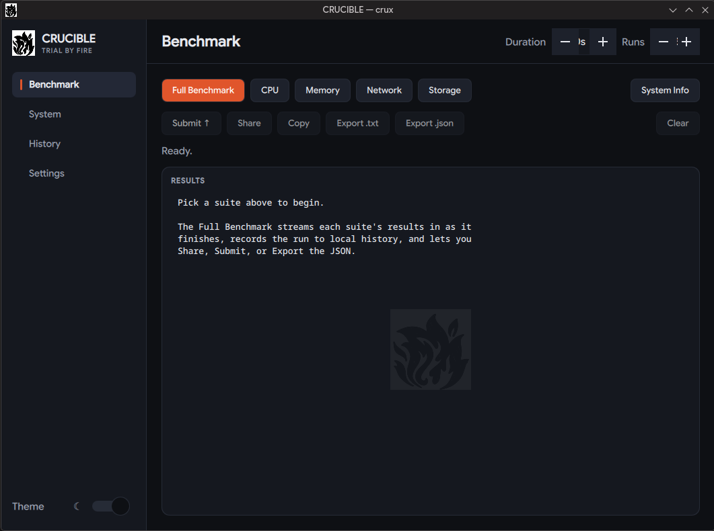

<div align="center">


# CRUCIBLE

**Trial by fire for your machine.**

A host-native CPU / memory / network / storage benchmark **and** a deep
system-info tool — written in Rust, no runtime dependencies.

[](LICENSE)
[](Cargo.toml)
[](gui/README.md)



</div>

---

CRUCIBLE compiles **natively on your machine** and puts it through a gauntlet,
then prints a report, records the run locally, and (by default) shares a copy
you can compare. The name is what it measures: **C**ompute · **R**AM ·
**U**tilization · **C**ache · **I**/O · **B**andwidth · **L**atency **E**valuation.

Two front-ends, one engine — identical numbers from either:

| | Front-end | Guide |
|---|-----------|-------|
| **CLI** | `crux` (+ `sysinfo` alias) | [docs/cli.md](docs/cli.md) |
| **GUI** | `crux-gui` (Qt 6 desktop app) | [gui/README.md](gui/README.md) |

## Install

Build-on-host script — CLI and GUI install independently:

```sh
# CLI only (default) · GUI only (needs Qt 6) · both
curl -sSf https://raw.githubusercontent.com/zsigisti/crucible/main/install.sh | bash
curl -sSf https://raw.githubusercontent.com/zsigisti/crucible/main/install.sh | bash -s -- --gui
curl -sSf https://raw.githubusercontent.com/zsigisti/crucible/main/install.sh | bash -s -- --all
```

Installs Rust + a C toolchain (and Qt 6 for `--gui`) if missing, builds with
`-C target-cpu=native`, and drops binaries in `~/.local/bin` (or `/usr/local/bin`
as root). The CLI adds the `sysinfo` alias, `man crux`, and completions; the GUI
adds an app-menu entry + icon. **Uninstall:** `./install.sh --uninstall` (or
`crux uninstall`, or the GUI's Settings → Uninstall; add `--purge-data` to drop
history).

<details>
<summary>From source / packages</summary>

```sh
git clone https://github.com/zsigisti/crucible && cd crucible
RUSTFLAGS="-C target-cpu=native" cargo build --release   # CLI only
cargo build -p crucible-gui --release                    # GUI (needs Qt 6)
```

A bare `cargo build` builds only the CLI, so CLI users never need Qt. For
AUR / deb / rpm see [docs/packaging.md](docs/packaging.md).
</details>

## Usage

```sh
crux                 # full benchmark (CPU + memory + network + storage)
crux bench cpu       # one suite: cpu | mem | net | disk | all
crux info            # deep system report (no benchmarking, no upload)
crux submit          # full run → submit to the score server (leaderboard)
crux history         # list locally recorded runs
crux compare A B     # diff two runs (files or history ids)
```

By default a run is recorded locally and shared to the score server (paste.rs
fallback). Every command, subcommand, and flag → **[docs/cli.md](docs/cli.md)**.

## What it measures

| Suite | Tests | Units |
|-------|-------|-------|
| **CPU** | BBP-π · SHA-256 · MatMul · LZ4 · Sort — single- **and** multi-threaded | + composite score & speedup |
| **Memory** | STREAM Copy / Scale / Add / Triad | GB/s |
| **Network** | Cloudflare latency (+jitter), download, upload | ms, Mbps |
| **Storage** | sequential R/W, random 4K latency, `O_DIRECT` | MB/s, µs (p50/p99) |

The algorithms, why they're trustworthy, and the bugs fixed along the way live
in **[docs/methodology.md](docs/methodology.md)**.

## Score server

The default share target is **`https://crux.mmzsigmond.me`** (override with
`CRUX_SERVER`); it ranks machines and lets you compare. Host your own by handing
**[web.md](web.md)** to a coding agent — a complete Rust + axum + SQLite + nginx
runbook. Grab just that file with `./scripts/get-server-guide.sh`.

## Documentation

| Doc | Contents |
|-----|----------|
| [docs/cli.md](docs/cli.md) | `crux` commands, subcommands, flags |
| [gui/README.md](gui/README.md) | The `crux-gui` desktop app |
| [docs/methodology.md](docs/methodology.md) | How each benchmark works and why it's correct |
| [docs/sysinfo.md](docs/sysinfo.md) | Everything `crux info` reports |
| [docs/architecture.md](docs/architecture.md) | Codebase layout and modules |
| [docs/packaging.md](docs/packaging.md) | AUR / deb / rpm, host-native build model |
| [web.md](web.md) | Score-server build runbook (for an AI agent) |

## License

GPL-3.0-or-later — see [LICENSE](LICENSE).
